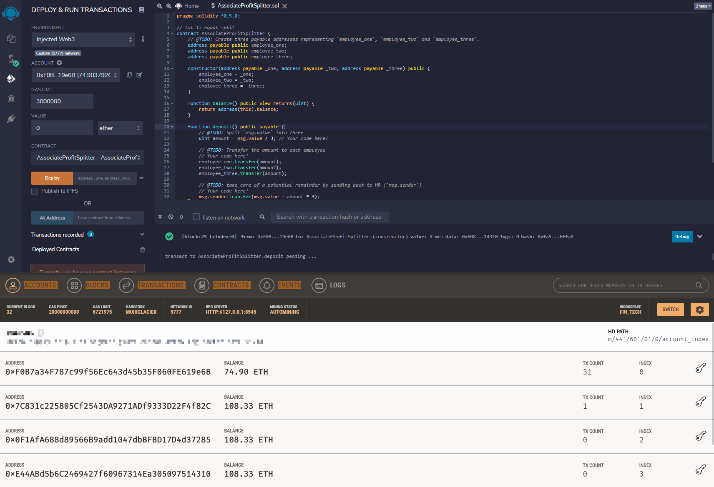

# solidity_homework_uw_fintech

## Level 1: AssociateProfitSplitter Contract
___
This [solidity contract](AssociateProfitSplitter.sol) enables an addresss to desposit equal transaction amounts into 3 separate accounts, each receiving roughly one-third of the deposit transaction with the remainder sent back to the account of origin. The below GIF demonstrates the deployment on a local host and on the [Ropsten Testnet](https://ropsten.etherscan.io/tx/0x5e409afd2fd5fa185aafebf6760295abe1fd9578e38a62d240278d44c81ce47f) from the Contract address: 0x0236d9264aC8f2bec7F58E27D4AAcC0eB0a46294 using the account 0xF0B7a34F787c99f56Ec643d45b35F060FE619e6B

### *Deployment & Transaction of Deposit Amount*

